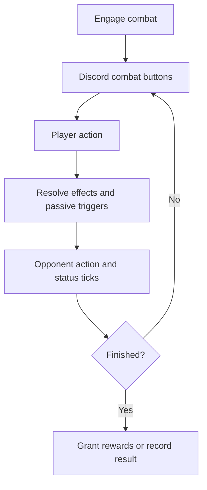

# Combat, Techniques, And Karma Design

Combat is data-driven, turn based, and shared by hunts, adventures, dungeons,
and PvP duels. The system should grow by adding JSON definitions and generic
effect handlers, not by adding one-off branches for individual martial arts.

For lower-level implementation rules, see `docs/COMBAT_PROGRESSION.md`.

## Activity Lanes

- Cultivation: `/cultivate` and `/breakthrough` drive qi and realm progress.
- Resources: `/gather` and `/hunt` provide herbs, ore, cores, beast parts, and manuals.
- Story: `/adventure` and `/dungeon` provide choices, moral shifts, bosses, and rarer drops.
- Builds: `/techniques`, `/technique`, `/learn`, and `/equip-technique` manage manuals and loadout.
- PvP: `/duel` runs turn-based arena combat after loadout legality checks.

Each lane has distinct primary rewards so short cooldown loops do not dominate
all progression.

## Stats

Primary combat stats come from realm, root, cultivation progress, equipment,
active effects, and modifiers:

- HP and max HP for survival.
- Internal strength for qi-based techniques.
- External strength for physical strikes.
- Agility for speed and dodge.
- Spiritual sense for crit and detection.
- Defense for damage reduction.
- Comprehension for gathering and learning support.
- Luck for rare drops and crit support.

Realm growth is defined in `config/realm_stats.json`. Realm names, qi caps, load
budgets, and rank caps are defined in `config/realms.json`.

## Technique Runtime

Techniques declare active `effects` and passive `passive_triggers` in
`config/techniques.json`. `src/combat/catalog.py` parses those definitions into
`TechniqueDef`, while `src/combat/effect_defs.py` defines the small runtime
objects used by combat resolution.

Supported event families include:

- `on_use`: active technique resolution.
- `on_hit`: after damage lands.
- `on_crit`: after a critical strike.
- `on_status_applied`: after a status is applied.
- `on_turn_start` and `on_turn_end`: per-combatant turn hooks.
- `on_hp_threshold`: threshold passives such as emergency healing.
- `on_cc_received`: control counterplay.
- `on_fatal`: survival passives.

Supported effect families include damage, multi-hit, status application, heal,
lifesteal, shield, cleanse, dodge, execute, reflect, cooldown adjustment, and
conditional bonuses.

Catalog fallbacks still parse older passive fields into trigger definitions so
existing content keeps working while entries are normalized.

## Status Rules

Status metadata lives in `config/combat_rules.json` and is loaded by
`src/combat/rules.py`.

Current status roles:

- `bleed`: stackable physical damage over time; enables lifesteal and bleed payoffs.
- `burn`: damage over time with spread and fire payoff hooks.
- `poison`: longer attrition and anti-heal support.
- `stun`: hard turn cancel.
- `seal`: damage reduction/control pressure.
- `fear`: chance to skip turns.

Status entries can carry tags such as `dot`, `control`, `cleanseable`, and
`anti_heal`. Control statuses also define diminishing-return metadata.

## Loadout And PvP Rules

Players equip four active techniques and one passive technique. Slot count stays
stable while load budgets limit total build weight by realm.

`src/combat/loadout.py` owns:

- learned technique lookup
- starter technique grants
- equip validation
- realm load budget checks
- PvP legality checks
- technique rank lookup

PvP legality checks currently cap legendary techniques, control tools, shield
tools, healing tools, and survival passives. Tuning values live in
`config/combat_rules.json`.

## Technique Rarity And Sources

Technique rarity affects active damage and acquisition exclusivity:

- `common`: baseline arts from early shops, common pools, and craft routes.
- `uncommon`: stronger arts from gambles, moral pools, sect routes, and upgraded craft routes.
- `rare`: higher-impact arts from breakthroughs, rare events, dungeon rewards, and elite hunts.
- `legendary`: high-impact arts reserved for strict reward paths.

Source-specific rarity caps live in `src/combat/rarity.py`. Manual drop pools
live in `config/manual_pools.json`; shop and sect routes live in `config/shop.json`
and `config/sect_shops.json`.

## Build Archetypes

The current roster supports discoverable build lanes:

- Sword and bleed: apply bleed, then convert it into sustain or finishers.
- Fire and burn: apply burn, amplify fire damage, then cash out with a finisher.
- Body and control: use shield, stun, seal, and Basic Strike pressure.
- Soul and attrition: poison and soul techniques pressure long fights.
- Utility and cleanse: remove statuses, dodge, shield, and survive burst windows.
- Critical tempo: stack crit, reflect, and consecutive-hit payoffs.

Use `synergy_hint`, `role`, `category`, `tags`, and effect primitives to make
these identities visible in `/techniques` and maintainable in config.

## Combat Flow



Combat sessions persist until victory, defeat, flee, finish, expiry, or duel
completion. Discord views show HP bars, statuses, technique cooldowns, Basic
Strike, flee, and finish actions.

## Karma

Karma ranges from `-100` to `+100` and begins neutral. Adventure choices shift
karma through `karma_delta` values in `config/adventure_encounters.json`.

Karma affects:

- breakthrough odds and setback tuning
- cultivation flavor
- manual pool weights
- profile tier display

Manual pool weighting is handled by `pick_manual_from_pool()` in
`src/manuals.py`, using `manual_weight_multiplier()` from `src/karma.py`.

## Manuals

Manual acquisition is intentionally spread across activities:

- cultivate and breakthrough rewards
- adventure moral pools and rare events
- hunt and dungeon drops
- shop listings and manual gambles
- craft/manual fragment routes
- sect shops and sect progression

Duplicate known manuals convert into technique fragments. Manuals above the
player's realm become sealed when the `sealed_manuals` flag is enabled and open
when the player reaches the required realm.

## Skill Ideas

`scripts/extract_skill_ideas.py` converts draft skill ideas into
`config/skill_idea_mapping.json` for review. The generated file maps source
codes, sect aliases, categories, roles, rarity, realm requirements, manual IDs,
and backlog reasons.

Promote an idea into runtime by adding or updating entries in the repo-owned
config files. Keep external schemas out of combat runtime code.

## Tests

Focused combat checks:

```powershell
py -m pytest tests/test_combat_engine.py -v
py -m pytest tests/test_combat_triggers_and_karma.py -v
py -m pytest tests/test_pvp_combat.py -v
py -m pytest tests/test_manual_acquisition.py -v
```

Add test coverage when changing effect order, status behavior, manual weights,
sealed manual behavior, load budgets, or PvP caps.
