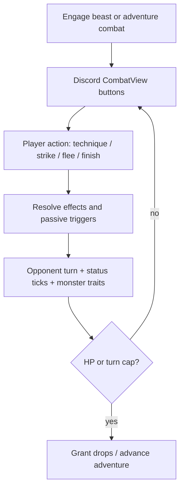

# Combat, Techniques & Karma Design

Data-driven combat with synergy lanes, earned karma, and alignment-weighted manual drops.

## Activity lanes

| Lane | Commands | Cooldown | Purpose |
|------|----------|----------|---------|
| Cultivation | `/cultivate`, `/breakthrough` | 15m / on demand | Qi, realm progression |
| Resource | `/gather`, `/hunt` | 5m each | Herbs, cores, beast parts, manuals |
| Story | `/adventure`, `/dungeon` | 20m / 2h | Branching runs, moral choices, bosses |

Each lane has **distinct primary drops** to avoid spamming the shortest cooldown.

## Primary stats (computed from realm + gear + modifiers)

| Stat | Role |
|------|------|
| HP / Max HP | Survival in combat |
| Internal Strength | Technique / qi-based damage |
| External Strength | Physical strikes |
| Agility | Speed, dodge |
| Spiritual Sense | Crit, detection |
| Defense | Damage reduction |
| Comprehension | Gather yields, learning |
| Luck | Rare drops, crit assist |

**Derived:** Crit Chance, Dodge (from Spiritual Sense, Agility, Luck).

Realm growth is defined in `config/realm_stats.json`. Gear maps: Power → internal+external, Defense → defense, Fortune → luck, Insight → spiritual sense + comprehension.

## Trigger engine (`src/combat/triggers.py`)

Techniques declare **`effects[]`** (active) and **`passive_triggers[]`** (passive) in `config/techniques.json`. The engine resolves them instead of hardcoded per-technique branches.

### Supported events

| Event | When fired |
|-------|------------|
| `on_use` | Technique resolves (damage, heal, status, lifesteal, shield, cleanse, dodge) |
| `on_hit` | After damage dealt (e.g. Hemorrhage Art bleed bonus) |
| `on_crit` | Critical strike confirmed (e.g. Mirror Nimbus reflect) |
| `on_status_applied` | Status successfully applied |
| `on_turn_start` / `on_turn_end` | Per combatant (e.g. Blood Feast heal) |
| `on_hp_threshold` | Cross below/above % HP once per fight (Lotus Revival) |
| `on_cc_received` | Stun/seal/fear applied to self (Iron Will) |
| `on_fatal` | Would drop to 0 HP (Undying Vow) |

### Combat state extensions

- `technique_cooldowns` — per-active CD (shown on CombatView buttons)
- `passive_cooldowns` — fight-scoped CD for emergency passives (Iron Will, Lotus Revival)
- `consecutive_hits` — tempo stack for Rising Tempo (resets on no-damage turn)
- `triggered_once` — once-per-fight flags (Undying Vow)
- `shield_hp` — absorb layer before HP (Mountain Guard, Iron Will)
- `opponent_traits` — monster kit tags from hunt/adventure foes

### Effect types

`damage`, `multi_hit`, `apply_status`, `lifesteal`, `heal`, `shield`, `cleanse`, `dodge_next`, conditional bonuses via `requires_status`, `bonus_vs_status`, `bonus_below_hp_pct`, etc.

Legacy fields (`passive_crit_bonus`, `passive_burn_bonus`, `passive_on_bleed`) are still supported via catalog fallbacks.

## Status effects

| Status | Role | Counter |
|--------|------|---------|
| **Bleed** | Stackable physical DoT; enables lifesteal/heal passives | Cleanse, burst before stacks |
| **Burn** | Single-stack burst DoT; amplifiable | Cleanse, high defense |
| **Poison** | Long low DoT; soul lane | Cleanse, heal over time |
| **Stun** | Hard skip turn | Iron Will passive |
| **Seal** | Blocks techniques only; Basic Strike still works | Basic Strike, Meridian counter-builds |
| **Fear** | Player damage −25% | Purifying Breath, tempo builds |

Formulas in `config/combat_rules.json`.

## Technique rarity & realm tiers

Each technique has a **realm tier** (Mortal / Earth — when you can equip) and a **rarity** (power + acquisition exclusivity):

| Rarity | Power | Typical sources |
|--------|-------|-----------------|
| **Common** | Baseline | Shop pamphlets, Unidentified Scroll, `/craft manual` (Mortal), Wandering Elder |
| **Uncommon** | +6% active damage | Scroll gamble, Earth craft, moral choices, hunt elites |
| **Rare** | +12% active damage | Breakthrough, inheritance events, dungeon bonus, hunt elites |
| **Legendary** | +20% active damage | Alignment moral choices, weekly dungeon boss, **never** shop |

Legendary passives (Iron Will, Lotus Revival, Undying Vow) and Heaven's Cleave are **exclusive** to moral paths, breakthrough alignment, and Blackwind Cavern.

## Technique roster (~29 techniques)

Every manual technique has **`alignment`** (righteous / demonic / neutral), **`role`** (applier / finisher / control / sustain / utility), and synergy hints on `/techniques`.

### Active lanes

| Lane | Core actives | Signature combo |
|------|--------------|-----------------|
| **Sword / Bleed** | Swift Slash, Iron Cleave, Sanguine Drain, Rending Flurry | Hemorrhage Art → bleed → Sanguine Drain lifesteal |
| **Fire / Burn** | Ember Palm, Flame Burst, Cinder Lance | Ember Heart → burn → Cinder Lance finisher |
| **Body / Control** | Iron Body, Meridian Strike, Mountain Guard | Seal → Basic Strike bypass |
| **Soul / Attrition** | Soul Needle, Void Pulse, Soul Siphon | Poison → Soul Siphon; **Venom Weave** amplifies poison |
| **Utility** | Qi Barrier, Mist Step, Purifying Breath | Cleanse + sustain |
| **Sword / Finisher** | Iron Cleave, **Heaven's Cleave** (Legendary) | Bleed setup → ultimate finisher |

### Passive highlights

| ID | Trigger | Effect |
|----|---------|--------|
| Keen Focus | passive | +5% crit |
| Ember Heart | on_use (burn) | +15% burn technique damage |
| Blood Feast | on_turn_end | Heal 5% max HP if foe bleeding |
| Hemorrhage Art | on_hit | +15% bleed chance on all attacks |
| Mirror Nimbus | on_crit | Reflect 30% damage dealt |
| Rising Tempo | on_hit | +5% damage per consecutive hit |
| Merciful Edge | on_use | +12% crit vs targets below 30% HP |
| Undying Vow | on_fatal | Survive at 1 HP; +40% damage 2 turns (once/fight) |
| Iron Will | on_cc_received | Cleanse stun; shield 15% max HP (CD 5) |
| Lotus Revival | on_hp_threshold | Below 30% HP: heal 30% max HP (CD 10) |
| Venom Weave | on_use (poison) | +12% poison technique damage |

### Discoverable build archetypes

| Build | Core loadout | Weak to |
|-------|--------------|---------|
| Blood Predator | Hemorrhage Art + Swift Slash + Sanguine Drain | Purifying Breath, burst |
| Ember Executioner | Ember Heart + Ember Palm + Cinder Lance | Cleanse, high defense |
| Seal Breaker | Meridian Strike + Basic Strike + Rising Tempo | Stun, Iron Will |
| Mirror Sage | Mirror Nimbus + Keen Focus + Qi Barrier | Poison attrition, seal |
| Lotus Guardian | Lotus Revival + Iron Will + Purifying Breath | Seal + sustained DPS |
| Undying Berserker | Undying Vow + Rending Flurry + Blood Feast | Burst before proc |
| Venom Ascendant | Venom Weave + Void Pulse + Soul Siphon | Cleanse-resistant attrition |

**Loadout:** 4 active + 1 passive slots (`/techniques`, `/equip-technique`, `/learn`).

## Turn-based combat

- Shared engine in `src/combat/` for hunt, adventure fights, duels
- Speed from agility (player) and attack (beasts); turn cap ~8 with **Finish** auto-resolve
- Hunt/adventure open Discord **CombatView** buttons: techniques (with CD labels; Basic Strike highlighted), Flee, Finish
- Combat sessions persist in `active_combats` until victory, defeat, flee, or expiry
- Rich embeds: HP bars, status badges, emoji combat log (`src/ui/`)



## Monster counterplay

Hunt beasts and adventure monsters can carry **traits** in config:

| Trait | Player answer |
|-------|---------------|
| `bleed_immune` | Burn, poison, control |
| `cleanse_every_3_turns` | Burst windows, not long DoT |
| `seal_on_hit` | Basic Strike loadout |
| `high_stun_chance` | Iron Will, Mountain Guard |

Defined in `config/hunt_targets.json` and `config/monsters.json`.

## Karma system

Karma replaces the old `/start` moral path choice. It is **earned through play**, not chosen at creation.

| Stat | Value |
|------|-------|
| Range | −100 to +100 (starts at 0) |
| Righteous tier | ≥ +30 |
| Neutral tier | −29 to +29 |
| Demonic tier | ≤ −30 |

### Karma effects

| System | Effect |
|--------|--------|
| **Breakthrough** | Success +0.04% per karma point (cap ±5%); fail setback scales ±0.1% per point (cap ±25%) |
| **Cultivation flavor** | Text from karma tier |
| **Manual pools** | Alignment-weighted selection (see below) |
| **Profile** | Karma bar + tier label on `/profile` |
| **Combat** | No direct stat bonus — identity via techniques and drops |

### Adventure moral choices

Encounters in `config/adventure_encounters.json` can offer choices with `karma_delta`, `manual_pool`, and distinct loot. Examples: injured elder, wounded rival, corrupt disciple, trapped spirit beast. Karma change is reported in adventure embeds.

Existing players migrate from legacy `moral_path`: righteous → +40, demonic → −40, neutral → 0.

## Manual pools

Pools in `config/manual_pools.json`. When rolling a manual, `pick_manual_from_pool()` in `src/manuals.py` applies karma bias:

```
righteous manual + righteous karma (≥30):  weight × 1.8
demonic manual + demonic karma (≤−30):     weight × 1.8
neutral manual:                            weight × 1.1
misaligned (righteous player, demonic manual): weight × 0.6  (never zero)
```

Notable pools:

| Pool | Source | Bias |
|------|--------|------|
| `righteous_elder` | Adventure moral event | Purifying Breath, Iron Will, Lotus Revival, Mountain Guard |
| `demonic_elder` | Adventure moral event | Sanguine Drain, Hemorrhage Art, Undying Vow, Soul Siphon |
| `neutral_wanderer` | General drops | Swift Slash, Mist Step, Rising Tempo, Keen Focus |
| `righteous_breakthrough` / `demonic_breakthrough` | High/low karma breakthrough | Alignment passives/actives |

**Drop philosophy:** Common actives from shop/craft/cultivate; Uncommon from gamble and Earth craft; Rare from breakthrough, inheritance, and hunt elites; **Legendary only from moral choices, alignment breakthrough, and weekly dungeon** — never shop.

## Adventure combat

- Encounters use `"type": "choice" | "combat"`
- Combat segments launch the same engine; monsters in `config/monsters.json`
- **Soft pity** for rare events: +5% gate per segment without rare, cap +25%
- `/adventure-continue` resumes mid-combat if Discord times out

## Config files

| File | Purpose |
|------|---------|
| `config/realm_stats.json` | Per-realm base stat growth |
| `config/techniques.json` | Technique defs, effects, passive triggers, alignment, role |
| `config/combat_rules.json` | Turn cap, status formulas |
| `config/manual_pools.json` | Manual drop pools with alignment mix |
| `config/hunt_targets.json` | Beasts, traits, drops |
| `config/monsters.json` | Adventure combat foes and traits |
| `config/adventure_encounters.json` | Choice/combat segments, moral events |
| `config/gather_nodes.json` | Herbs/ores per area |
| `config/items.json` | Manual items for new techniques |

## Tests

- `tests/test_combat_triggers_and_karma.py` — trigger resolution, karma tiers, manual weight bias
- `tests/test_combat_engine.py` — turn flow, status, finish
- Integration tests cover adventure moral encounters and expanded technique catalog
